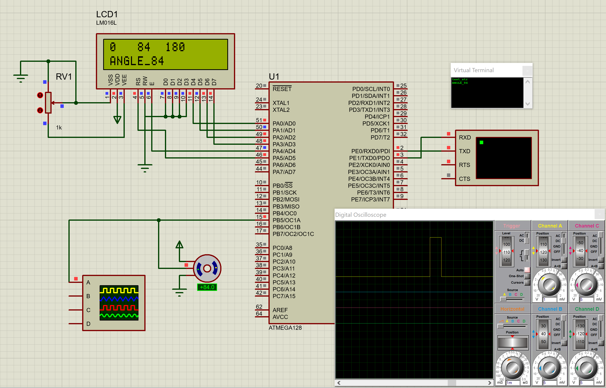

Для задания:

Собрать схему и составить программу интерпретатор преобразующий команду, поступившую по интерфейсу обмена UART, в ШИМ сигнал определенной скважности для управления положением стандартного сервопривода. В программе предусмотреть фильтрацию сигнала и ограничение на угол поворота сервопривода, принятую команду и параметры ШИМ сигнала вывести на дисплее.

Assemble a circuit and create an interpreter program that converts the command received via the UART exchange interface into a PWM signal of a certain duty cycle to control the position of a standard servo drive. The program should provide for signal filtering and limitation on the angle of rotation of the servo drive, display the received command and parameters of the PWM signal on the display.

